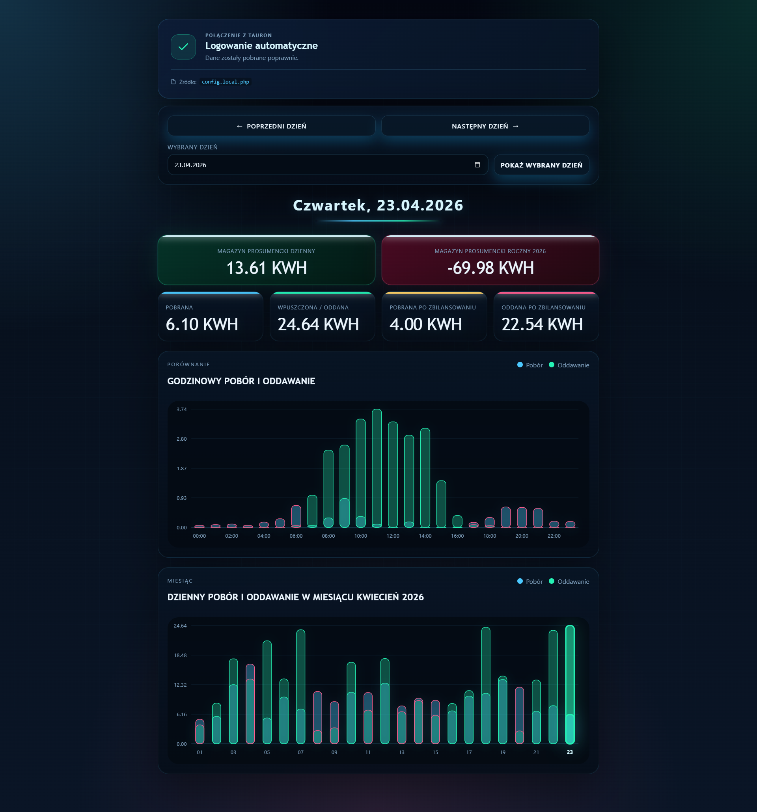

# Tauron Daily Energy App (stare zasady 80%)

Moderny dashboard do monitorowania zużycia energii elektrycznej, zaprojektowany z myślą o estetyce i czytelności. Aplikacja loguje się do serwisu **eLicznik** i wizualizuje dane pobrane prosto z Twojego licznika.

## ✨ Nowe funkcje (Modernizacja UI)

- **Interfejs Glassmorphism**: Nowoczesny wygląd z efektami rozmycia i przezroczystości.
- **Dynamiczny Status**: Animowane ikony informujące o stanie połączenia z serwerami Tauron.
- **Global Loading Bar**: Wizualizacja postępu pobierania danych w czasie rzeczywistym.
- **Zoptymalizowany Picker Daty**: Poprawiona widoczność ikony kalendarza oraz wygodny układ przycisków "Poprzedni/Następny dzień".
- **Responsive Design**: Pełna obsługa urządzeń mobilnych.

## 📊 Co monitorujemy?

- Zużycie energii (Pobór)
- Energię oddaną do sieci (Eksport)
- Bilans magazynu prosumenckiego (dzienny i roczny)
- Interaktywne wykresy godzinowe oraz miesięczne



## 🚀 Uruchomienie

1. Wgraj pliki na serwer z obsługą **Apache + PHP 8.0+**.
2. Upewnij się, że masz włączone rozszerzenie PHP `curl`.
3. Skonfiguruj plik `config.local.php`:

```php
<?php
return [
    'TAURON_USERNAME' => 'twoj_login',
    'TAURON_PASSWORD' => 'twoje_haslo',
    'TAURON_SITE_ID'  => 'opcjonalny_identyfikator',
];
```

## 🔒 Bezpieczeństwo

Dane logowania są przechowywane w pliku `config.local.php`, który jest wykonywany po stronie serwera. Dzięki temu Twoje hasło nigdy nie jest wystawione na widok publiczny.

## 🛠 Struktura projektu

- `index.php` – Główny widok aplikacji (HTML5/PHP).
- `public/styles.css` – Nowoczesny system stylizacji.
- `public/app.js` – Logika frontendu i wizualizacja danych.
- `api/today.php` – Backend obsługujący komunikację z Tauronem.

---
*Projekt zmodernizowany z dbałością o detale i UX.*
