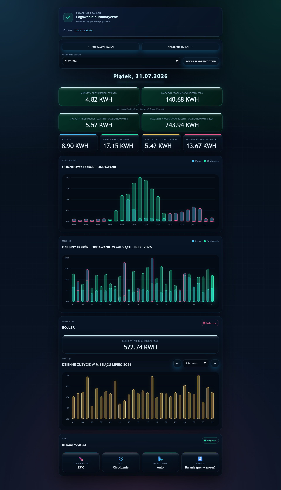

# Tauron Daily Energy App (stare zasady 80%)

Moderny dashboard do monitorowania zużycia energii elektrycznej, zaprojektowany z myślą o estetyce i czytelności. Aplikacja loguje się do serwisu **eLicznik** i wizualizuje dane pobrane prosto z Twojego licznika.

## ✨ Nowe funkcje (Modernizacja UI)

- **Interfejs Glassmorphism**: Nowoczesny wygląd z efektami rozmycia i przezroczystości.
- **Dynamiczny Status**: Animowane ikony informujące o stanie połączenia z serwerami Tauron.
- **Global Loading Bar**: Wizualizacja postępu pobierania danych w czasie rzeczywistym.
- **Zoptymalizowany Picker Daty**: Poprawiona widoczność ikony kalendarza oraz wygodny układ przycisków "Poprzedni/Następny dzień".
- **Responsive Design**: Pełna obsługa urządzeń mobilnych.

## 📊 Co monitorujemy?

- Zużycie energii (Pobór)
- Energię oddaną do sieci (Eksport)
- Bilans magazynu prosumenckiego (dzienny i roczny), liczony zarówno z surowych, jak i zbilansowanych przez Tauron wartości
- Interaktywne wykresy godzinowe oraz miesięczne
- Opcjonalnie: zużycie energii przez urządzenie podłączone do lokalnego gniazdka **TP-Link Tapo P110** (np. bojler) — status włączenia, roczny licznik zużycia i wykres dzienny dla wybranego miesiąca



## 🚀 Uruchomienie

1. Wgraj pliki na serwer z obsługą **Apache + PHP 8.0+**.
2. Upewnij się, że masz włączone rozszerzenia PHP `curl` i `openssl`.
3. Skonfiguruj plik `config.local.php`:

```php
<?php
return [
    'TAURON_USERNAME' => 'twoj_login',
    'TAURON_PASSWORD' => 'twoje_haslo',
    'TAURON_SITE_ID'  => 'opcjonalny_identyfikator',
];
```

## 🔌 Gniazdko Tapo P110 (opcjonalnie)

Aplikacja może dodatkowo pokazywać zużycie energii z lokalnego gniazdka **TP-Link Tapo P110** (np. podłączonego do bojlera). Integracja komunikuje się z gniazdkiem bezpośrednio w sieci lokalnej (protokół KLAP), więc **serwer PHP musi działać w tej samej sieci LAN co gniazdko** (np. na Raspberry Pi w domu) — hosting zewnętrzny nie ma dostępu do adresów prywatnych typu `192.168.x.x`.

Aby włączyć tę sekcję, dopisz w `config.local.php`:

```php
'TAPO_BOILER_IP'   => '192.168.1.50',
'TAPO_EMAIL'       => 'email_do_konta_tp-link',
'TAPO_PASSWORD'    => 'haslo_do_konta_tp-link',
'TAPO_BOILER_NAME' => 'Bojler',
```

Jeśli te pola są puste, sekcja po prostu się nie pokazuje — reszta aplikacji działa bez zmian.

**Ważne — firmware 1.4.0+:** nowsze firmware Tapo domyślnie blokuje lokalne API dla aplikacji innych firm (błąd `HTTP 403` na handshake). Trzeba to ręcznie włączyć w aplikacji Tapo: **Me → Third-Party Services → Third-Party Compatibility**.

## 🔒 Bezpieczeństwo

Dane logowania są przechowywane w pliku `config.local.php`, który jest wykonywany po stronie serwera. Dzięki temu Twoje hasło nigdy nie jest wystawione na widok publiczny.

## 🛠 Struktura projektu

- `index.php` – Główny widok aplikacji (HTML5/PHP).
- `public/styles.css` – Nowoczesny system stylizacji.
- `public/app.js` – Logika frontendu i wizualizacja danych.
- `api/today.php` – Backend obsługujący komunikację z Tauronem.
- `api/boiler.php` – Backend obsługujący lokalną komunikację (protokół KLAP) z gniazdkiem Tapo P110.

---
*Projekt zmodernizowany z dbałością o detale i UX.*
